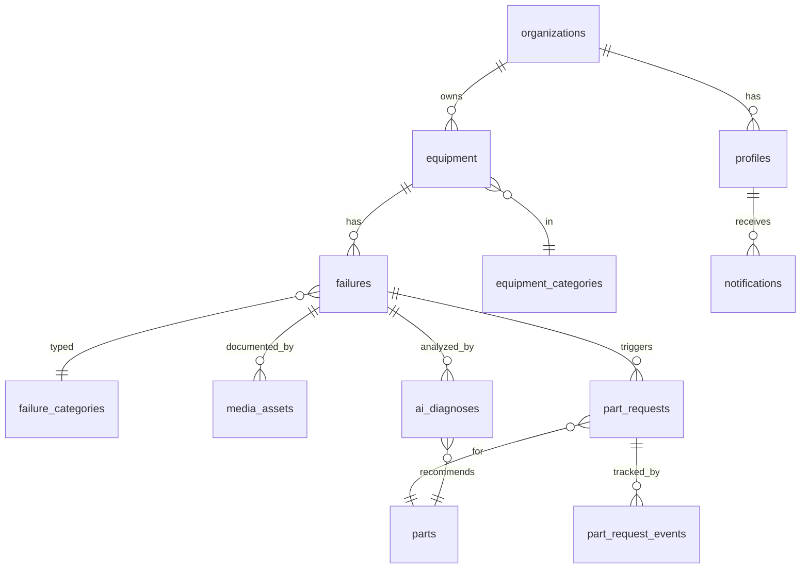

# 🏆 Plan de Bataille — Smart Industrial Asset Intelligence

> **Mission :** ne pas livrer « encore une interface IA fade ». Livrer une plateforme qui raconte une seule idée forte, du premier écran au dernier slide, et qui *fonctionne* en live.

Ce document est la source de vérité de l'équipe. Tout le monde le lit avant d'écrire une ligne de code. Si une décision n'est pas ici, on l'ajoute ici avant de la prendre.

---

## 0. Pourquoi on gagne (la thèse)

Le barème dit où sont vraiment les points : **Compréhension du problème (20) + Fonctionnalités (25) + Structure des données (15) = 60 %.** L'innovation ne pèse que 10 %, la présentation 5 %. Conclusion : la majorité des équipes vont se battre pour le vernis IA ; nous, on gagne sur le fond, et l'innovation devient le clou du spectacle plutôt qu'un cache-misère.

**Le fil rouge unique qui traverse les 7 critères :**

> Preuve visuelle → l'IA la **structure** → la donnée se **bonifie** → l'analytique révèle les **tendances** → la **prédiction** devient possible.

C'est un *flywheel* : chaque panne loggée rend la suivante mieux comprise. Notre produit n'est pas un cahier de doléances numérique, c'est une **machine à fabriquer de la donnée industrielle exploitable**.

**L'insight que 80 % vont rater :** la vision finale parle d'**économies émergentes**. Là-bas, le vrai coût n'est pas la panne — c'est le **délai d'approvisionnement des pièces** (dépendance aux imports). Donc notre analytique ne se contente pas de compter les pannes : elle mesure le **temps passé à chaque étape du workflow** pour exposer les goulots d'approvisionnement. C'est ça, « comprendre le problème ».

---

## 1. Le produit en une phrase + le périmètre

**Une PWA qui transforme chaque panne photographiée en donnée structurée et en action — du diagnostic IA jusqu'à la livraison de la pièce — et qui en tire de l'intelligence industrielle.**

**Dans le périmètre (les 9 modules obligatoires) :**
1. Gestion des équipements (+ fiche : n° série, modèle, fabricant, date d'achat)
2. Profil d'équipement (historique pannes + maintenances + statut)
3. Déclaration de panne (description, gravité, date, **preuves visuelles obligatoires**)
4. Capture visuelle guidée multi-angles (obligatoire)
5. Demande de pièces (liée à la panne, urgence, suivi)
6. Workflow 7 étapes : Soumis → Analyse → Inspection → Validation → Fabrication/Sourcing → Livraison → Clôture
7. Dashboard Admin
8. Dashboard Analytics
9. Notifications

**Hors périmètre (on assume et on le dit au jury) :** vraie ML de prédiction entraînée (impossible sans historique en 48 h — on la *promet* via le flywheel, on ne la *fake* pas), gestion de stock complète, facturation.

**Règle d'or de scope :** un **chemin de démo à 100 %**, le reste en scaffolding propre. Mieux vaut un parcours fluide que neuf écrans à moitié cassés.

---

## 2. La stack (décidée, pas négociable sauf raison technique)

| Couche | Choix | Pourquoi |
|---|---|---|
| Frontend | **Next.js + TypeScript** | PWA native, routes API colocalisées, rapide |
| Style | **Tailwind + shadcn/ui** | composants beaux qu'on *possède* et customise, zéro temps perdu |
| Animation | **Framer Motion** | l'effet « comment ils ont fait ça en 48 h » |
| Backend + DB | **Supabase (Postgres)** | Postgres = vraie structure de données (15 %) |
| Auth / multi-tenant | **Supabase Auth + RLS** | isolation par entreprise propre = bonus jury |
| Stockage médias | **Supabase Storage** | photos / scans des pannes |
| Temps réel | **Supabase Realtime** | le pipeline qui s'anime en direct = effet waouh gratuit |
| IA Vision | **Modèle vision (Claude / Gemini / GPT-class)** appelé **côté serveur** | jamais de clé API dans le client |
| Déploiement | **Vercel** | déploiement continu, URL partageable au jury |

**Pourquoi pas les alternatives :** Firebase est NoSQL → combat le critère structure des données. FastAPI seul → on reconstruirait auth + storage + realtime à la main (heures perdues). On ne garde Python que si on isole le service IA, sinon tout reste en TS.

---

## 3. Architecture

```
┌─────────────────────────────────────────────────────┐
│                  PWA (Next.js)                        │
│  Écrans · Framer Motion · caméra · installable        │
│         │ realtime subscriptions │ appels serveur     │
└─────────┼───────────────────────┼─────────────────────┘
          │                       │
   ┌──────▼──────┐        ┌───────▼────────────────┐
   │  Supabase   │        │ Route serveur / Edge Fn │
   │ Postgres+RLS│        │  → appel modèle vision  │
   │ Auth·Storage│◄───────│  → sortie JSON struct.  │
   │  Realtime   │  write │  → écrit ai_diagnoses   │
   └─────────────┘        └─────────────────────────┘
```

Point clé : **l'IA n'affiche pas un résultat, elle écrit un enregistrement structuré** (`ai_diagnoses`) qui pré-remplit la demande de pièce et nourrit l'analytique. C'est le flywheel en code.

---

## 4. Le modèle de données (le joyau — 15 % se jouent ici)

Deux décisions qui nous mettent au-dessus du lot :

1. **Le workflow n'est PAS un champ `statut`.** C'est un **journal d'événements horodatés** (`part_request_events`). Ça donne : la timeline animée, le temps réel, ET l'analytique de durée par étape (notre insight délais).
2. **Multi-tenant par RLS.** Chaque ligne porte `org_id`, chaque entreprise ne voit que ses données.

### ERD



### Schéma SQL (Postgres / Supabase — copiable tel quel)

```sql
-- ENUMS
create type user_role         as enum ('admin','manager','technician');
create type equipment_status  as enum ('operational','degraded','down','maintenance');
create type severity          as enum ('low','medium','high','critical');
create type failure_status     as enum ('open','diagnosed','resolved','closed');
create type request_urgency   as enum ('low','medium','high','urgent');
create type workflow_status   as enum ('submitted','analysis','inspection','validation','sourcing','delivery','closed');
create type media_kind        as enum ('photo','scan3d');

-- RACINE MULTI-TENANT
create table organizations (
  id uuid primary key default gen_random_uuid(),
  name text not null,
  created_at timestamptz not null default now()
);

create table profiles (
  id uuid primary key references auth.users(id) on delete cascade,
  org_id uuid not null references organizations(id) on delete cascade,
  full_name text,
  role user_role not null default 'technician',
  created_at timestamptz not null default now()
);

-- TAXONOMIES
create table equipment_categories (
  id uuid primary key default gen_random_uuid(),
  org_id uuid references organizations(id) on delete cascade,
  name text not null
);
create table failure_categories (
  id uuid primary key default gen_random_uuid(),
  name text not null            -- taxonomie partagée
);
create table parts (
  id uuid primary key default gen_random_uuid(),
  name text not null,
  sku text,
  category text,
  typical_lead_time_days int
);

-- ÉQUIPEMENTS
create table equipment (
  id uuid primary key default gen_random_uuid(),
  org_id uuid not null references organizations(id) on delete cascade,
  category_id uuid references equipment_categories(id),
  name text not null,
  serial_number text,
  model text,
  manufacturer text,
  purchase_date date,
  status equipment_status not null default 'operational', -- état courant (vérité = events)
  photo_url text,
  created_at timestamptz not null default now()
);

-- PANNES
create table failures (
  id uuid primary key default gen_random_uuid(),
  org_id uuid not null references organizations(id) on delete cascade,
  equipment_id uuid not null references equipment(id) on delete cascade,
  reported_by uuid references profiles(id),
  failure_category_id uuid references failure_categories(id),
  description text,
  severity severity not null default 'medium',
  status failure_status not null default 'open',
  created_at timestamptz not null default now()
);

-- PREUVES VISUELLES
create table media_assets (
  id uuid primary key default gen_random_uuid(),
  org_id uuid not null references organizations(id) on delete cascade,
  failure_id uuid references failures(id) on delete cascade,
  equipment_id uuid references equipment(id) on delete cascade,
  storage_path text not null,
  kind media_kind not null default 'photo',
  uploaded_by uuid references profiles(id),
  created_at timestamptz not null default now()
);

-- DIAGNOSTIC IA (sortie STRUCTURÉE = le flywheel)
create table ai_diagnoses (
  id uuid primary key default gen_random_uuid(),
  org_id uuid not null references organizations(id) on delete cascade,
  failure_id uuid not null references failures(id) on delete cascade,
  media_id uuid references media_assets(id),
  model text,
  defect_label text,
  failure_category_id uuid references failure_categories(id),
  severity_estimate severity,
  confidence numeric,                       -- 0..1
  recommended_part_id uuid references parts(id),
  recommended_part_text text,
  raw_response jsonb,
  created_at timestamptz not null default now()
);

-- DEMANDES DE PIÈCES (porte le workflow 7 étapes)
create table part_requests (
  id uuid primary key default gen_random_uuid(),
  org_id uuid not null references organizations(id) on delete cascade,
  equipment_id uuid not null references equipment(id) on delete cascade,
  failure_id uuid references failures(id) on delete set null,
  part_id uuid references parts(id),
  requested_by uuid references profiles(id),
  description text,
  urgency request_urgency not null default 'medium',
  current_status workflow_status not null default 'submitted',
  from_ai boolean not null default false,   -- recommandée par l'IA ?
  created_at timestamptz not null default now()
);

-- JOURNAL D'ÉVÉNEMENTS DU WORKFLOW (l'audit log — pièce maîtresse)
create table part_request_events (
  id uuid primary key default gen_random_uuid(),
  part_request_id uuid not null references part_requests(id) on delete cascade,
  from_status workflow_status,
  to_status workflow_status not null,
  actor_id uuid references profiles(id),
  note text,
  created_at timestamptz not null default now()
);

-- NOTIFICATIONS
create table notifications (
  id uuid primary key default gen_random_uuid(),
  org_id uuid not null references organizations(id) on delete cascade,
  user_id uuid not null references profiles(id) on delete cascade,
  type text not null,
  payload jsonb,
  read_at timestamptz,
  created_at timestamptz not null default now()
);
```

### RLS (à appliquer sur CHAQUE table porteuse de `org_id`)

```sql
alter table equipment enable row level security;

create policy "tenant_read" on equipment for select
  using ( org_id = (select org_id from profiles where id = auth.uid()) );

create policy "tenant_write" on equipment for insert
  with check ( org_id = (select org_id from profiles where id = auth.uid()) );
-- … répéter le motif (select/insert/update/delete) sur chaque table tenant.
```

### Vues analytiques (l'intelligence)

```sql
-- Machines les plus en panne
create view v_top_failing_equipment as
select e.id, e.name, count(f.id) as failure_count
from equipment e left join failures f on f.equipment_id = e.id
group by e.id, e.name order by failure_count desc;

-- Pièces les plus demandées
create view v_top_requested_parts as
select coalesce(p.name, pr.description) as part, count(*) as n
from part_requests pr left join parts p on p.id = pr.part_id
group by 1 order by n desc;

-- ⭐ Temps moyen passé À CHAQUE ÉTAPE (l'insight délais d'appro)
create view v_avg_time_per_stage as
select stage, avg(extract(epoch from (next_at - created_at))/3600) as avg_hours
from (
  select to_status as stage, created_at,
         lead(created_at) over (partition by part_request_id order by created_at) as next_at
  from part_request_events
) t
where next_at is not null
group by stage;
```

> La vue `v_avg_time_per_stage` est notre arme secrète de pitch : elle prouve, données à l'appui, *où* le délai d'approvisionnement se bloque.

---

## 5. Les modules — chemin de démo vs scaffolding

**Chemin de démo (à 100 %, fluide, animé, zéro bug) :**
Déclarer une panne + capture guidée → **diagnostic IA en live** → demande de pièce pré-remplie → workflow qui avance en **temps réel** côté admin → la pièce apparaît dans l'**analytique**.

**Scaffolding propre (présent, fonctionnel, moins poli) :** liste/fiche équipement, profil avec historiques, gestion admin des entreprises, notifications, mode hors-ligne basique.

---

## 6. L'innovation : Diagnostic Visuel par IA (spec)

**Flux :**
1. Le technicien déclare une panne, prend les photos guidées multi-angles.
2. Upload vers Supabase Storage.
3. Une **route serveur / Edge Function** envoie l'image + un prompt au modèle vision et exige une **réponse JSON stricte**.
4. On parse, on valide, on écrit dans `ai_diagnoses`, on **pré-remplit** la demande de pièce.
5. L'UI révèle le diagnostic avec une animation soignée (Framer Motion).

**Contrat de sortie (JSON strict demandé au modèle) :**
```json
{
  "defect_label": "string",
  "failure_category": "string",
  "severity": "low|medium|high|critical",
  "confidence": 0.0,
  "recommended_part": "string",
  "reasoning_brief": "string (1-2 phrases)"
}
```
Parsing **défensif** : retirer d'éventuelles ``` ```json ``` ```, valider chaque champ, fallback gracieux si invalide.

**Sécurité (et bonus jury) :** la clé API vit **uniquement côté serveur**. Jamais dans le client.

**Filet de sécurité démo :** prévoir un échantillon mis en cache + une saisie manuelle de secours, au cas où le réseau du lieu lâche. La latence est masquée par une animation de chargement premium.

**Ce qu'on NE fait pas :** une fausse courbe de « maintenance prédictive ». On seed des données historiques réalistes pour que l'analytique soit crédible, et on présente la prédiction comme la **suite logique** du flywheel.

---

## 7. Répartition des 5 rôles

> Tout dépend d'un jalon : **le schéma doit être en ligne avant que les autres construisent.** C'est la priorité absolue des 4 premières heures.

| Rôle | Périmètre | Possède |
|---|---|---|
| **Lead / Archi + Data** | Schéma, RLS, setup Supabase, glue d'intégration, garde la vision | la cohérence du tout |
| **Front Design System** | Tailwind + shadcn + Framer, navigation, langage visuel, PWA (install + caméra) | l'identité visuelle |
| **Front Features** | Écrans : équipement, déclaration + capture guidée, demande de pièce, timeline workflow, dashboards | les parcours |
| **Backend / Realtime** | Machine à états du workflow + `part_request_events`, subscriptions temps réel, notifications, vues analytiques | le moteur vivant |
| **IA + Pitch** | Feature diagnostic visuel de bout en bout, seed de données réalistes, script + slides de démo, présente | l'effet waouh |

En pratique on se met en binômes selon les pics de charge. Le rôle « IA + Pitch » prépare la démo en parallèle dès que le chemin existe.

---

## 8. Planning 48 h (jalons à ne pas rater)

| Bloc | Objectif | Jalon |
|---|---|---|
| **H0–H2** | Kickoff, scope verrouillé, repo + projet Supabase + Vercel + env, langage visuel choisi, schéma v1 rédigé | — |
| **H2–H6** | Schéma déployé + RLS + données seedées ; base design system + Framer ; auth | **J1 — on se connecte et on voit des données réalistes** |
| **H6–H16** | Écrans du chemin critique (équipement, déclaration + capture + upload, demande de pièce) ; moteur workflow + events + realtime *(rotation sommeil)* | **J2 (~H16) — parcours bout-en-bout brut qui marche** |
| **H16–H28** | Diagnostic IA intégré → écrit en base → pré-remplit la pièce ; timeline workflow live ; dashboard admin ; notifications | **J3 (~H28) — l'innovation marche en live + le pipeline s'anime en temps réel** |
| **H28–H38** | Dashboard analytique (les vues, dont temps/étape) ; polish animations, états vides/erreur ; PWA install + caméra ; offline basique si temps | **J4 (~H38) — feature-complete, ça ressemble à un produit** |
| **H38–H44** | Chasse aux bugs, perfectionnement des données de démo, **2 répétitions de démo**, filet IA en cache, README + doc technique | **J5 (~H44) — démo répétée 2× sans bug** |
| **H44–H48** | Polish final, **freeze à H46** (on ne touche plus au code de démo), répétition pitch, buffer | — |

---

## 9. Script de démo (5 min — 5 % au barème, mais ça colore TOUT le reste)

| Temps | Séquence |
|---|---|
| 0:00–0:30 | **Le hook.** Le vrai problème : dans les économies émergentes, ce qui coûte cher c'est le délai pour obtenir la pièce. Une phrase, percutante. |
| 0:30–2:30 | **Le flux live.** Un technicien trouve une machine en panne → capture guidée multi-angles → **l'IA diagnostique le défaut + recommande la pièce, en direct** (le waouh) → un tap crée la demande pré-remplie. |
| 2:30–3:30 | **Le workflow prend vie.** On passe côté admin, on fait avancer la demande dans le pipeline → ça se met à jour **en temps réel** sur l'écran du technicien + notification. |
| 3:30–4:30 | **Le flywheel.** Dashboard analytique : machines les plus fragiles, pièces les plus demandées, **temps moyen bloqué par étape** (l'insight délais) — « chaque diagnostic enrichit ça → demain, la prédiction. » |
| 4:30–5:00 | **La vision.** L'avenir de l'intelligence industrielle dans les économies émergentes. Une phrase qui claque. |

---

## 10. Règles anti-slop (Definition of Done)

Aucun écran ne sort sans : **état de chargement, état vide, état d'erreur.**
- Zéro erreur console pendant la démo.
- Toute sortie IA est **validée** avant affichage.
- Les animations ont un **but** (révéler, guider) — jamais gratuites.
- Données seedées **réalistes** (noms d'usines, de machines crédibles — pas « test test »).
- **Une** personne possède le laptop de démo ; la démo tourne sur un état propre et répété.
- Secrets **côté serveur uniquement**.
- Chaque PR relue par au moins une autre personne — on ne pousse pas de code qu'on n'a pas lu.

---

## 11. Setup & conventions

- **Repo unique** Next.js, branches courtes par feature, PR + relecture rapide.
- `.env.local` : `NEXT_PUBLIC_SUPABASE_URL`, `NEXT_PUBLIC_SUPABASE_ANON_KEY` (client), clé service + clé IA **serveur uniquement** (jamais préfixées `NEXT_PUBLIC_`).
- README dès H2 : comment lancer, comment seeder, architecture en 5 lignes.
- Déploiement Vercel continu → on a toujours une URL démontrable.

---

### À clarifier au démarrage
- Vérifier les slides 5 et 6 du PPT (vides à l'extraction — probablement des visuels de workflow/archi). Si elles contiennent une contrainte, on l'intègre ici.
- Confirmer le modèle vision disponible sur place / la connexion internet du lieu (impacte le filet de sécurité IA).

**On n'est pas là pour faire du déjà-vu. Une idée, portée jusqu'au bout, qui marche en live. C'est comme ça qu'on gagne.**
